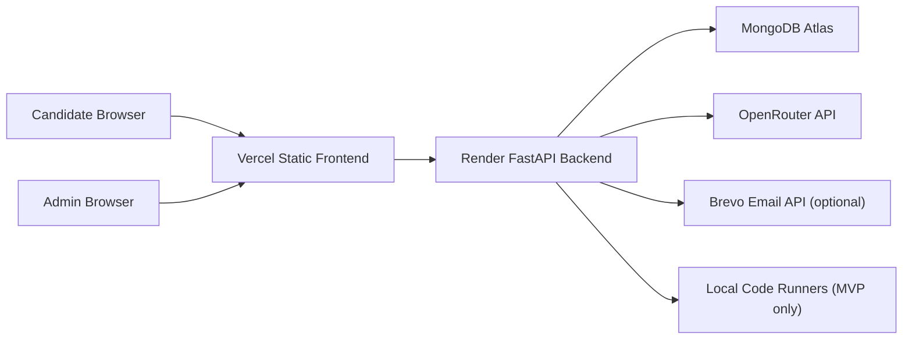

# AI Adaptive Interview Deployment Guide

This project is deployment-ready as a stable MVP with a split deployment:

- Frontend: Vercel static site from `forenten/`
- Backend: Render Python web service from `backend/`
- Database: MongoDB Atlas
- AI provider: OpenRouter

Do not deploy the FastAPI backend as a Vercel serverless function. This backend performs long-running AI calls, code execution, PDF generation, file uploads, and restart-sensitive workflow restoration. Keep it on a persistent web service such as Render.

## Architecture

## Render Backend

Create a Render Web Service using the repository root and `render.yaml`, or configure manually:

- Root directory: `backend`
- Runtime: Python 3
- Build command: `pip install -r requirements.txt`
- Start command: `uvicorn uploded:app --host 0.0.0.0 --port $PORT`
- Health check path: `/health`

Required Render environment variables:

- `MONGO_URI`: MongoDB Atlas connection string.
- `OPENROUTER_API_KEY`: OpenRouter API key.
- `FRONTEND_URL`: Vercel production frontend URL, for example `https://ai-adaptive-interview-liart.vercel.app`.

Optional Render environment variables:

- `BREVO_API_KEY`: enables email delivery.
- `BREVO_SENDER_EMAIL`: verified Brevo sender address.
- `BREVO_SENDER_NAME`: sender display name.

Do not set `USE_MOCK_MONGO` in production.

## Vercel Frontend

Create a Vercel project with either of these safe options:

- Root directory: repository root, using `vercel.json` with `outputDirectory: "forenten"`
- Or root directory: `forenten`, using `forenten/vercel.json`
- Framework preset: Other
- Build command: empty / none
- Output directory: `forenten` from repo root, or `.` from the `forenten` root

The static frontend reads API URLs from `forenten/config.js`.

Production values currently configured:

- API: `https://ai-adaptive-interview-1hsw.onrender.com`
- Frontend: `https://ai-adaptive-interview-liart.vercel.app`

If your Render or Vercel URLs change, update `forenten/config.js` and set Render `FRONTEND_URL` to the same Vercel domain.

## Firebase Hosting (Alternative Frontend)

Firebase Hosting is configured for the `forenten/` directory using `firebase.json` and `.firebaserc`.

1. Install Firebase CLI and authenticate.
2. Ensure the project is `ai-interview-4f3a3` and hosting site is `arahinfotech-interview`.
3. Deploy with: `firebase deploy --only hosting:arahinfotech-interview`.

If you use Firebase Hosting, set `FRONTEND_URL` (and optionally `FRONTEND_URLS`) in the backend to the Firebase domain(s).

## Cloud Run Backend (Dockerfile)

Cloud Run can deploy the backend using the root `Dockerfile`. The container runs `uvicorn uploded:app` on port `8080`.

Recommended environment variables:

- `MONGO_URI`
- `OPENROUTER_API_KEY`
- `FRONTEND_URL`
- `FRONTEND_URLS` (comma-separated)
- `UPLOAD_ROOT=/tmp/ai-interview` (optional, Cloud Run defaults to `/tmp`)
- `GRIDFS_ENABLED=true` (optional, enables GridFS recordings)
- `GRIDFS_BUCKET=recordings`

## MongoDB Atlas

Atlas must allow Render outbound access. For a portfolio/demo deployment, you can temporarily allow `0.0.0.0/0`, but production should use the narrowest possible access control supported by your hosting plan.

Collections used by the app:

- `admins`
- `candidates`
- `interviews`
- `answers`
- `interview_sessions`

## Deployment Validation Checklist

After deploying:

1. Open `https://<render-service>.onrender.com/health`.
2. Open the Vercel admin page.
3. Log in with the configured admin account.
4. Create a candidate session.
5. Open the generated candidate link.
6. Start the interview.
7. Submit at least one answer.
8. Verify AI score and feedback.
9. Start a coding round.
10. Run Python and JavaScript submissions.
11. Generate a PDF report.
12. Restart the Render service and confirm the session restores from MongoDB.

## Known MVP Limitations

- Admin auth is demo-grade and should be replaced with JWT and password hashing before real use.
- Coding execution runs inside the backend process environment. Use isolated sandbox workers before production.
- Whisper is not installed by default; `/transcribe` gracefully falls back.
- Brevo email is optional and inactive until configured.
- AI-generated coding tests need stricter validation before high-stakes use.
- Uploaded reports and recordings are stored on the service filesystem. Render filesystem is ephemeral, so use object storage for durable media.

## Rollback

Render keeps the previous successful deploy running if a new deploy fails. For manual rollback, redeploy a previous commit from the Render dashboard. For frontend rollback, use Vercel's deployment history and promote a previous deployment.
