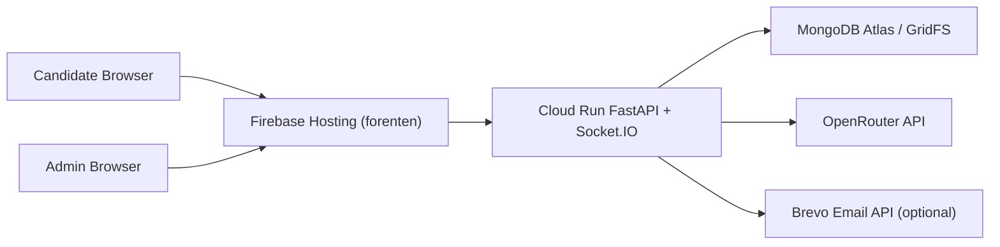

# AI Adaptive Interview Deployment Guide

This deployment guide is stabilized for:

- Frontend: Firebase Hosting (`forenten/`)
- Backend: Google Cloud Run (root `Dockerfile`)
- Database + media storage: MongoDB Atlas + GridFS
- AI provider: OpenRouter

## Architecture

## Firebase Hosting

Configured by:

- `firebase.json` (public = `forenten`)
- `.firebaserc` (project/site mapping)

The frontend reads backend endpoints from `forenten/config.js` via:

- `window.RUNTIME_CONFIG.API_BASE_URL` (required in production)
- `window.RUNTIME_CONFIG.SOCKET_BASE_URL` (optional; defaults to API base)

## Cloud Run Backend

Cloud Run deploys from the repository root Dockerfile.

- Base image: `python:3.11-slim`
- Installs `ffmpeg`
- Starts: `uvicorn uploded:app --host 0.0.0.0 --port 8080`

### Required Cloud Run env vars

- `MONGO_URI`
- `OPENROUTER_API_KEY`
- `FRONTEND_URL`
- `FRONTEND_URLS`
- `SOCKETIO_CORS_ORIGINS`
- `GRIDFS_ENABLED=true`
- `GRIDFS_BUCKET` (for example `interview_recordings`)

### Optional Cloud Run env vars

- `UPLOAD_ROOT=/tmp/ai-interview`
- `BREVO_API_KEY`
- `BREVO_SENDER_EMAIL`
- `BREVO_SENDER_NAME`

### Deprecated / unused in active path

- `CLOUDINARY_CLOUD_NAME`
- `CLOUDINARY_API_KEY`
- `CLOUDINARY_API_SECRET`
- `FIREBASE_PROJECT_ID`
- `FIREBASE_ADMIN_CREDENTIALS_JSON`

## Runtime Constraints (stabilized)

- Recording uploads are GridFS-only (Cloudinary path disabled).
- Coding execution is Python-only.
- Active runtime transcription endpoint is `/transcribe` in `backend/uploded.py`.
- `backend/transcription.py` is retained for compatibility and must not be removed blindly.

## Deployment Validation Checklist

After manual deploy:

1. Open `https://<cloud-run-service-url>/health`.
2. Open Firebase hosted admin page.
3. Admin login + create session.
4. Candidate link starts interview and loads questions.
5. Verify transcript appears in candidate view.
6. Verify admin receives `live_update` transcript and `live_frame`.
7. Submit at least one answer; verify AI score/feedback persistence.
8. Start coding round; verify Python run path.
9. Complete interview; verify `/upload-full-recording` stores in GridFS.
10. Verify recording retrieval from `/recordings/gridfs/{file_id}`.
